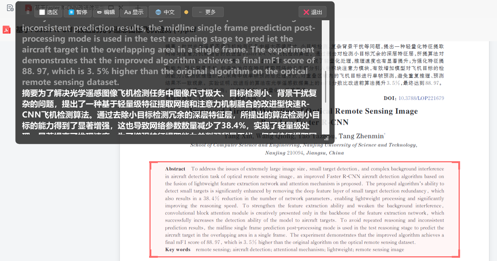

# 屏幕翻译 - 离线屏幕识别 / 翻译 / 查词工具

每秒识别屏幕指定区域文字、离线翻译为目标语言，并以半透明字幕条实时显示。

**已内置离线翻译模型：中文 / 英语 / 日语 / 韩语 / 繁体中文**，任意两种互译
（没有直达模型的方向会自动经英语中转，如 日→英→中）。

- 点击字幕里的英文单词即可查询音标 + 释义（离线 ECDICT 词典，77万词条）
- 支持剪贴板复制、字幕历史、生词本、TTS 朗读（单词 + 整段）、Anki 导出
- 翻译引擎：Argos Translate（完全离线，断网可用），可选百度 API
- 翻译缓存持久化：翻过的句子秒出，暂停/重扫恢复时不再干等
- 多区域轮询：最多同时监控 3 个屏幕区域，轮流扫描互不干扰
- 选区红框常驻显示：屏幕上随时可见当前识别范围（红框不挡鼠标）
- 点击穿透：字幕窗口只显示不挡鼠标操作，全局热键一键开关
- 字幕窗口直接拖动：左键按住工具栏/空白处即可拖



> 上图为真实运行截图：红框是识别区域，字幕条同时显示原文与译文。
> 点字幕里的英文单词即可查音标与释义。

## 直接使用（下载即用）

从 [Releases](https://github.com/AndrewLinic/screen_translator/releases) 下载
`屏幕翻译-精简版.zip`（约 250MB，不含离线翻译模型）解压后：

```
屏幕翻译\
├── 屏幕翻译.exe           # 主程序，双击运行
├── _internal\             # 运行时依赖（含 ECDICT 词典 77 万词条）
├── offline_translate.py   # 离线翻译引擎（exe 通过它调用模型）
├── model_fetch.py         # 模型下载（首次启动自动调用）
├── install_models.py      # 手动安装/追加语言模型
├── pyenv.json             # 解释器路径（留空 = 自动探测）
└── install_offline_translate.bat  # 一键准备离线翻译依赖（首次使用跑一次）
```

**首次使用**：
1. 双击 `屏幕翻译.exe` —— OCR（系统引擎）、划词查词、字幕显示立刻可用
2. 想用**离线翻译**：先双击 `install_offline_translate.bat` 装好 Python 依赖，
   再双击 `屏幕翻译.exe` —— 程序发现没有模型会**自动下载中英双向（约 165MB）**，
   进度可在字幕栏状态灯悬停查看
3. 需要日 / 韩 / 繁等更多语言：`python install_models.py ja ko zt`

> 首次启动会把模型同步到 `%LOCALAPPDATA%\ScreenTranslator\models`
> （CTranslate2 无法加载中文路径下的模型，所以必须放到英文目录），
> 约需 10~30 秒，之后启动就是秒开。
>
> 想用**高精度 OCR**（RapidOCR，误识率明显低于系统引擎）还需在同一个
> Python 里补装：`<pyenv.json 里的 python> -m pip install rapidocr onnxruntime`。
> 完整版（自带模型）的打包方式见下方「重新打包」。

## 开箱即用的功能（无需任何安装）

| 功能 | 说明 |
|---|---|
| OCR 文字识别 | 双引擎：RapidOCR 高精度（PP-OCRv6）/ Windows 系统 OCR 极速，可自动择优 |
| 字幕悬浮显示 | 半透明置顶字幕条，原文+译文（可切换逐行对照模式） |
| 单词查询 | 点字幕里的英文单词 → 音标+多释义+词形变化 |
| 复制原文/译文 | 字幕「⋯更多」菜单一键复制 |
| 字幕历史 | 最近 5 条字幕可滚动查看 |
| 生词本 | 自动收藏查询过的词，支持导出 Anki CSV |
| TTS 朗读 | Windows SAPI 离线朗读（单词 + 整段原文/译文） |
| 多区域轮询 | 最多同时监控 3 个屏幕区域，轮流扫描、彩色指示框区分 |
| 点击穿透 | 字幕窗口只显示不挡鼠标，全局热键/托盘切换 |
| 翻译缓存 | 翻过的句子持久化缓存，暂停/重扫恢复秒出 |
| OCR 误识反馈 | 一键导出诊断包（截图+日志），方便反馈识别错误 |
| 外观面板 | 主题/透明度/字号/显示模式/朗读语速均可调 |
| 系统托盘 | 双击切换、托盘菜单所有功能 |

## 翻译语言（中 / 英 / 日 / 韩 / 繁 任意互译）

设置里直接选「源语言 / 目标语言」，支持自动检测。模型装在：

```
%LOCALAPPDATA%\ScreenTranslator\models\
```

想删掉某个语言，删掉对应 `translate-xx_yy-x_x` 文件夹即可；想看当前装了哪些，
设置窗口里点「📂 打开模型目录」。

> 繁体中文的语言代码是 `zt`（不是 zh-Hant）。

### 安装更多语言

```bat
:: 装法语、德语（双向各约 70~300MB）
python install_models.py fr de
:: 装繁体中文
python install_models.py zt
:: 查看全部可用语言
python install_models.py --list
:: 一键装齐核心语言
python install_models.py --all-core
```

脚本自带多个下载镜像，装完重启程序即可在新语言间互译。

## 翻译引擎说明

| 引擎 | 说明 |
|---|---|
| Argos 离线（默认） | 完全离线，中/英/日/韩/繁互译，缺直达方向时自动经英语中转 |
| 百度 API（可选） | 设置里填 AppID/Secret 后可用，语种更多、译文更自然 |
| Mock | 调试用，只加 `[译文]` 前缀 |

> 引擎模式：`offline_first`（默认，离线优先）/ `online_first`（在线优先）/
> `offline_only`（仅离线）/ `online_only`（仅在线）/ `mock`（调试）。

> 中文路径坑：模型必须放在英文路径，程序已自动处理。

## 字幕工具栏

```
[⠿] [⬜ 选区] [⏸ 暂停] [✏ 编辑] [🔁 重扫] [Aa 显示] [🌐 语言] [⋯ 更多] [❌ 退出]
```

| 按钮 | 作用 |
|---|---|
| ⠿ | 按住（或工具栏空白处）拖动窗口 |
| ⬜ 选区 | 拖框选择屏幕识别区域 |
| ⏸ 暂停/▶ 继续 | 暂停/恢复识别 |
| ✏ 编辑 | OCR 识别有错漏时，修改文本后重新翻译 |
| 🔁 重扫 | 强制重新识别翻译当前内容（Ctrl+Alt+R） |
| Aa 显示 | 字号/显示原文/逐行对照/主题/透明度/朗读语速 |
| 🌐 语言 | 切换翻译目标语言（下拉菜单，显示当前语言） |
| ⋯ 更多 | 复制原文/译文、朗读原文/译文、历史、生词本、点击穿透、重新识别 |
| ❌ 退出 | 关闭程序 |

> 长文本自动换行，超出窗口高度时在**纵向滚动条**里滚动；
> 窗口右下角可**拖动调整大小**（最小不低于按钮完整展示的尺寸），字体大小不随窗口变化。

> 右键字幕里的英文单词 → 查词 / 朗读 / 加入生词本 / 复制
> **右键长按拖动**选择单词或词组（原文区和译文区都可以）→ 松开即查词
> 双击原文或点 ✏编辑 → 修改识别错误的文本后重新翻译

## 多区域轮询（最多 3 个）

1. **添加区域**：右键托盘图标 → **➕ 添加识别区域（多区域轮询，最多3个）**，弹出全屏选框拖一个框，重复可加到 3 个（各配红/橙/绿指示框）。直接选「选择识别区域」会清空多区域、回到单区域。
2. **查看结果**：字幕窗顶部出现 **1 / 2 / 3 彩色小按钮**，点击手动切换；某区域识别到新内容时自动切过去。
3. **清除多区域**：托盘菜单 → **🗑 清除多区域**，恢复单区域。
4. **机制**：程序轮流扫描各区域（每轮一个，OCR 耗时不叠加），翻译由单调度线程串行处理，多区域同时变化不会打架；暂停/重扫对全部区域生效。

## 点击穿透与全局热键

- **点击穿透**：字幕窗口开启后只显示不响应鼠标（鼠标能点到字幕底下的内容），
  可通过「⋯更多 → 📌 点击穿透」或托盘菜单切换。
- **全局热键**（仅 Windows）：
  - `Ctrl+Alt+T` 切换点击穿透（被占用时自动回退 `Ctrl+Alt+G`/`P`/`Y`）
  - `Ctrl+Alt+R` 重新识别当前内容（被占用时回退 `Ctrl+Alt+E`）
  - 实际生效的组合键会显示在托盘菜单「📌 点击穿透」项里。

## OCR 引擎（识别精度 vs 速度）

设置 → 语种 → **OCR 引擎** 三选一：

| 引擎 | 单次耗时 | 精度（同图 CER，越低越好） | 说明 |
|---|---|---|---|
| **RapidOCR 高精度**（默认） | 0.5~0.9 秒 | **0.000~0.018** | PP-OCRv6 模型，游戏小字/花体误读明显更少 |
| Windows 快速 | 0.05~0.2 秒 | 0.010~0.042 | 系统自带，几乎不占资源 |
| 自动择优 | 两者相加 | 取两者中更优 | 两个引擎都跑，按"词典命中率 + 质量分"选更好的 |

实测同一批游戏截图，RapidOCR 的残留误读还会落到既有修复链能覆盖的形态上
（如 `Ofyour`→`of your`、`t1Ying`→`trying`），所以**全链路最终 CER 基本为 0**。

RapidOCR 跑在独立子进程里（`ocr_worker.py`），原因有二：
1. onnxruntime 与 PyQt5/winocr 同进程会 DLL 冲突；
2. onnxruntime + opencv 约 200MB，不打进 exe，绿色包体积不变。

子进程用 `pyenv.json` 指向的 Python（与离线翻译同一个环境）启动，
用不了就**自动回退 Windows 引擎**，识别链路不会中断。安装：

```bash
<pyenv.json 里的 python> -m pip install rapidocr
```

> RapidOCR 内置中英多语言模型，中日英之外的语种（日/韩/俄/繁体）
> 会尝试加载专用模型，本地没有时自动退回内置模型或 Windows 引擎。

## 文本后处理（OCR 结果在翻译前的整形）

识别到的原始文本会先过下面几道整形，再送去翻译：

1. **视觉换行合并**（`ocr._join_visual_lines`）
   屏幕上的折行不是语义分段，原样保留会让翻译引擎（argostranslate 内部按
   `\n` 切分）**按行独立翻译**，译文被强行切碎。所以句中断行一律用空格接上；
   只有这两种情况保留换行：
   - 上一行以句末标点结尾（`.!?…。！？；;`）
   - 本行是标签行（`Reward: ...`）或列表项（`- xxx`）——标签必须独占一行，
     否则游戏标签拆分逻辑会失效

   中日文之间合并不补空格（中文本来不用空格）。

2. **拉丁文误识修复**（`ocr._repair_latin_words`）
   顺序是**先合并、再修复**：修复里的"句中误大写还原"需要完整句子上下文才敢
   下判断（`with patrons Who` 的 `Who` 是看见前面的 `with` 才判成小写）。

   已覆盖的形态：

   | 形态 | 例子 |
   |---|---|
   | 词尾字母被抬成大写 | `goatS`→`goats`、`WhO`→`who`、`ThE`→`The` |
   | 词中夹一个孤立大写 | `trYing`→`trying`、`BasiCS`→`Basics` |
   | 缩写尾部误大写 | `donT`→`don't`、`canT`→`can't`、`wonT`→`won't` |
   | 字母被识成数字 | `t1Ying`→`trying`、`c0ck`→`cock`、`h4ve`→`have` |
   | 多个字母同时被识成数字 | `P01nt`→`point`（0→o 且 1→i 需同时成立） |
   | 吞空格 | `Ofyour`→`of your`、`ofthe`→`of the` |
   | 句中词首误大写 | `size Ofyour Cock`→`size of your cock` |

   专名（`Lusterfield`/`Sebas`/`McDonald`）、缩略语（`USA`/`IT`）、正常大小写
   的词一律不动——宁可少改，不改错。型号编号（`H2SO4`/`sha256`/`B2B`/`COVID-19`/
   `B12`）因末尾就是数字而被护栏排除，实测 23 个样本零误伤。

3. **词频仲裁**（`build_lexicon.py` → `lexicon_data.py`）
   `1` 既可能是 `l`/`i` 也可能是 `r`（`th1s` 该还原成 `this` 还是 `thrs`？），
   而 ecdict 里 `thrs`/`wart` 也是词，单靠候选顺序会系统性选错。改用 ecdict 的
   `bnc`/`frq` 榜单排名做仲裁：**候选中有排名的优先、排名小者优先**。

   | 正确 | bnc/frq | 垃圾候选 | bnc/frq |
   |---|---|---|---|
   | this | 23 / 20 | thrs | 无 |
   | wait | 463 / 400 | wart | 15233 |
   | time | 50 / 52 | tlme | 无 |
   | from | 27 / 26 | flom | 无 |

   5.7 万个有排名的词压成 zlib+base64 常量写进 `lexicon_data.py`（约 530KB），
   运行期解压只要几十毫秒 —— 不必每次去解析 66MB 的 csv。

4. **专名保护**（`ocr._load_proper_names`）
   "句中误大写还原"靠上下文判定，而 `with Mark`（介词 + 人名）与 `at Night`
   （介词 + 普通词）结构完全一样，只能靠词表区分。专名表（人名 / 姓氏 / 地名 /
   月份星期 / 品牌，约 1 万词）里的词一律不还原：

   - `with Mark` → `with Mark`（保住人名）
   - `at Night` → `at night`、`of Course` → `of course`（普通词照旧修）

   表里刻意排除 `will`/`may`/`can` 等情态助动词 —— 它们作普通词的频率远高于作
   人名，保护起来会让 `You May go` 这类误大写永远修不回来。

5. **多帧投票**（`main._vote_texts`）
   字幕叠在动态场景上时，每帧截图都有细微差异（背景在动、抗锯齿抖动），OCR 结果
   随之浮动 —— 同一个词这帧读对、下帧读错。把同一画面连续识别的多帧结果按"词"取
   多数，把偶发误识压下去：

   - 第 1 帧照常立刻出结果（不增加"看到第一条译文"的等待）
   - 后续帧的投票结果若与已送出的内容一致，不会重复翻译
   - 同一画面最多识别 `vote_frames` 次（默认 3），投满即停
   - 各帧词数差异过大（对齐不可靠）时退回最长的一条

   把 `config.json` 里的 `vote_frames` 设为 `1` 即可关闭投票。

## OCR 误识反馈

识别结果有错时，可在设置里点「反馈误识」导出一个诊断包（含截图 + 日志），
方便把识别错误的场景反馈给开发者定位问题。

## 系统托盘菜单

右键点击托盘图标"译"打开菜单，所有功能都在这里：

| 菜单项 | 作用 |
|---|---|
| ▶ 开始识别 / ⏸ 停止识别 | 切换识别状态（双击托盘图标同效） |
| 🌐 当前翻译语言 | 查看并快速切换目标语言（中/英/日/韩/繁…） |
| ⬜ 选择识别区域… | 拖框选区，屏幕上会显示常驻红框 |
| ➕ 添加识别区域 | 进入多区域轮询模式（最多 3 个，彩色指示框） |
| 🗑 清除多区域 | 退出多区域，恢复单区域 |
| 🔁 重新识别 | 强制重扫当前区域 |
| 🖥 识别整个主屏幕 | 全屏识别（红框隐藏） |
| 🔍 OCR 识别语言 | 切换识别语言（看日文选日本語、韩文选한국어） |
| 📌 点击穿透 | 开关字幕窗口鼠标穿透（显示实际生效热键） |
| ⚙ 设置… / 📖 查词 / 📚 生词本 / ⌚ 历史 / 🧹 清空 | 同字幕工具栏 |
| ❌ 退出程序 | 完全退出 |

> 翻译不出现时先检查：① 选区内是否真有文字 ② OCR 识别语言是否匹配。
> OCR 命中后字幕会先显示原文 + "⏳ 翻译中…"（首次加载模型约 10~30 秒，之后秒翻）。

> 双击托盘图标可快速切换开始/暂停识别。

## 从源码运行

需要 Python 3.10+：

```bat
:: 创建虚拟环境
python -m venv venv
venv\Scripts\activate
:: 装依赖
pip install -r requirements.txt
:: 装离线翻译 (可选)
python download_assets.py
:: 启动
python main.py
```

## 项目结构

```
自动读屏翻译/
├── main.py                # 主入口 - 托盘 + 字幕 + 定时识别
├── subtitle.py            # 字幕窗口 - 富文本 / 工具栏 / 历史 / 拖动
├── region_overlay.py      # 选区常驻红框指示（点击穿透）
├── dict_window.py         # 单词查询弹窗 - 音标/释义/朗读/加入生词本
├── dict_lookup.py         # 离线词典 ECDICT 查询
├── vocab.py               # SQLite 生词本 + Anki CSV 导出
├── vocab_window.py        # 生词本查看窗口
├── translator.py          # Argos 离线翻译(含中转) + 百度 API + Mock 兜底
├── offline_translate.py   # 离线翻译子进程（exe 通过它调用模型，自包含）
├── trans_cache.py         # 翻译缓存持久化（SQLite，跨会话复用）
├── install_models.py      # 下载/安装离线翻译模型（支持多语言、多镜像）
├── model_fetch.py         # 模型下载/解压公共实现（install_models 与自动下载共用）
├── pylocator.py           # 解释器自动探测（不写死任何机器路径）
├── tts.py                 # Windows SAPI 离线朗读
├── ocr.py                 # OCR 引擎路由(rapidocr/windows/auto) + 拉丁文误识修复链
├── ocr_rapid.py           # RapidOCR 客户端（管理常驻识别子进程）
├── ocr_worker.py          # RapidOCR 子进程本体（PP-OCRv6，随 exe 放在同级目录）
├── build_lexicon.py       # 由 ecdict.csv 生成词频表+专名表（换词典后重跑）
├── lexicon_data.py        # 词频/专名数据（zlib+base64，自动生成，勿手改）
├── screenshot.py          # mss 截图 + PyQt5 全屏选区器
├── hotkeys.py             # 全局热键（点击穿透 / 重扫，Win32 工作线程）
├── settings_dialog.py     # 设置 UI - 引擎 / 语种 / 密钥
├── config.py              # 配置持久化 (~/.screen_translator/config.json)
│
├── assets/
│   ├── ecdict.csv         # 离线英汉词典 (63MB, 77万词条)
│   ├── ecdict.mini.csv    # 词典迷你版 (调试用)
│   └── argos_models/      # 离线翻译模型 (中/英/日/韩/繁)
│
├── screen_translator.spec # PyInstaller 打包配置
├── deploy.py              # ★ 一键部署：打包 + 比对 + 增量换入 + 回归
├── run_tests.py           # 批量回归测试（自动发现 v4~v22）
├── make_release.py        # 打发布 zip（默认精简版，--full 含模型）
├── publish_release.py     # ★ 建 GitHub Release 并上传附件（幂等）
├── build.bat              # 全量打包脚本（首次出包 / 彻底重建时用）
├── install_offline_translate.bat # 用户安装离线翻译依赖
├── download_assets.py     # 模型/词典下载脚本
├── requirements.txt       # Python 依赖清单
├── docs/                  # README 用截图
├── LICENSE                # MIT
└── run.bat                # 开发模式启动脚本
```

## 配置

配置文件位置：`%USERPROFILE%\.screen_translator\config.json`

```json
{
  "engine_mode": "offline_first",   // 翻译引擎: offline_first / online_first / offline_only / online_only / mock
  "baidu_app_id": "",                // 百度翻译 API
  "baidu_secret": "",
  "source_lang": "auto",             // 原文语种 (auto=自动)
  "target_lang": "zh",               // 译文语种
  "ocr_lang": "zh-Hans-CN",          // OCR 语言
  "ocr_engine": "rapidocr",          // OCR 引擎: rapidocr / windows / auto
  "region": null,                    // 截屏区域 [x,y,w,h]，null=全屏
  "interval_ms": 1000,               // 识别间隔 (毫秒)
  "vote_frames": 3,                  // 多帧投票帧数 (1=关闭，见"文本后处理")
  "font_size": 22,                   // 译文字号
  "font_size_original": 18,          // 原文字号
  "show_original": true,             // 是否在字幕显示原文
  "display_mode": "block",           // block=分块 / interleave=双语逐行对照
  "theme": "dark",                   // 字幕主题: dark / light
  "window_opacity": 0.92,            // 字幕窗口不透明度 0.3~1.0
  "tts_rate": 0,                     // 整段朗读语速 -5(慢)~5(快)
  "click_through": false,            // 鼠标点击穿透
  "regions": null,                   // 多区域 [(x,y,w,h),...]，非空启用多区域(最多3)
  "subtitle_geometry": null,         // 字幕窗口位置与大小 [x,y,w,h]
  "auto_start": true,                // 启动后自动开始识别
  "auto_fetch_models": true          // 首次启动无模型时自动下载中英双向 (精简版)
}
```

## 性能

| 阶段 | 耗时 |
|---|---|
| 截图 (1920×1080) | ~10 ms |
| OCR (中) | ~20 ms |
| OCR (英) | ~5 ms |
| Argos 翻译 (首次) | ~4 s (模型加载) |
| Argos 翻译 (后续) | ~100 ms / 句 |
| 词典查询 | <1 ms |

完全跑满 1 秒/次的刷新频率仍富余很多。

## 重新打包 / 发布

日常迭代推荐用一键部署脚本（**只改 Python 代码时，通常只需换一个 7.7MB 的 exe**）：

```bat
python deploy.py                :: 打包 -> 比对 _internal -> 增量换入 -> 回归测试
python deploy.py --dry-run      :: 只看会改什么，不动文件
python deploy.py --no-build     :: 跳过打包，复用上次 dist_tmp
python deploy.py --no-test      :: 部署后不跑回归
python deploy.py --keep         :: 保留 build_tmp / dist_tmp
```

它做四件事：① 用独立的 `build_tmp` / `dist_tmp` 构建（避开安全钩子）；
② 比对新旧 `_internal`，一致就**只换 exe**；③ 同步 `assets` 与 9 个随附脚本；
④ 跑一遍回归测试。首次出包或要彻底重建时才用 `build.bat`。

单独跑回归测试：

```bat
python run_tests.py             :: 全部 v4~v21
python run_tests.py v18 v19 v20 :: 只跑改到的部分（提速）
```

生成的 exe 在 `dist\屏幕翻译\屏幕翻译.exe`。

- `_internal\`：程序本体 + PyQt5 + ECDICT 词典（约 240 MB）
- `assets\argos_models\`：离线翻译模型（中/英/日/韩/繁共约 790 MB，可自行增删）

### 出发布包（上传 GitHub Releases）

模型 842MB 不适合塞进仓库或让用户一次下完，所以发布包**不含模型**，
由程序首次启动自动下载（见「直接使用」）：

```bat
python make_release.py                  :: 出精简版 zip（约 210MB）★推荐
python make_release.py --tag v1.0.0     :: 版本号写进包名
python make_release.py --full           :: 含模型（约 900MB，自用/传盘用）
python make_release.py --dry-run        :: 只统计不打包

python publish_release.py --tag v1.0.0  :: 建 Release 并上传附件（自动取最新 zip）
python publish_release.py --tag v1.0.0 --replace   :: 同名附件先删后传
python publish_release.py --tag v1.0.0 --draft     :: 存草稿
```

`make_release.py` 产出在 `release\屏幕翻译-精简版[-tag].zip`；
`publish_release.py` 直接调 GitHub API 建 Release 并上传，重复执行是幂等的
（已存在就复用，附件同名则跳过）。token 自动从 Windows 凭据管理器里
Git Credential Manager 已存的那条读取，不落盘。

> 两个坑：GitHub 会把非 ASCII 附件名清洗成 `-.-`，所以脚本上传前会把包名转成
> `screen-translator-slim-v1.0.0.zip` 这类英文名；Git Bash 里的 `curl` 是
> schannel 版，`--cacert` 无效，所以脚本走 Python + 项目自定义 CA 包。
> 想手动上传也可以，把 zip 拖到
> [Releases 新建页](https://github.com/AndrewLinic/screen_translator/releases/new) 即可。

> 打包踩坑：
> - PyInstaller 清理旧产物时若被安全策略拦截，用 `--workpath`/`--distpath`
>   指定全新临时目录再拷回来（`deploy.py` 已内置这套规避）。
> - 目录级 `rename`/`mv` 同样会被拦，换入一律**逐文件 copy**。
> - 打包前先确认没有旧实例在跑，否则 `_internal` 被占用换不动。

## 许可证

[MIT](LICENSE) © 2026 AndrewLinic

用到的第三方组件各自遵循其自身许可：Argos Translate 模型（MIT）、
ECDICT 词典（MIT）、RapidOCR / PP-OCRv6（Apache-2.0）、PyQt5（GPL v3）、
百度翻译开放平台 API（自有条款，需自备密钥）。
